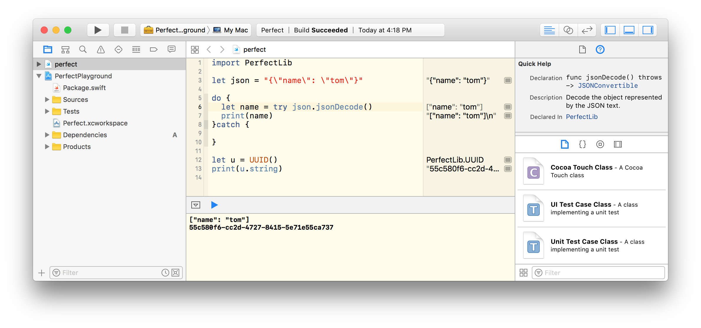

# Perfect 游乐场 [English](README.md)

<p align="center">
    <a href="http://perfect.org/get-involved.html" target="_blank">
        
    </a>
</p>

<p align="center">
    <a href="https://github.com/PerfectlySoft/Perfect" target="_blank">
        
    </a>  
    <a href="https://gitter.im/PerfectlySoft/Perfect" target="_blank">
        
    </a>  
    <a href="https://twitter.com/perfectlysoft" target="_blank">
        
    </a>  
    <a href="http://perfect.ly" target="_blank">
        
    </a>
</p>

<p align="center">
    <a href="https://developer.apple.com/swift/" target="_blank">
        
    </a>
    <a href="https://developer.apple.com/swift/" target="_blank">
        
    </a>
    <a href="http://perfect.org/licensing.html" target="_blank">
        
    </a>
    <a href="http://twitter.com/PerfectlySoft" target="_blank">
        
    </a>
    <a href="https://gitter.im/PerfectlySoft/Perfect?utm_source=badge&utm_medium=badge&utm_campaign=pr-badge&utm_content=badge" target="_blank">
        
    </a>
    <a href="http://perfect.ly" target="_blank">
        
    </a>
</p>


该项目展示了如何将Swift Playground集成到您的Perfect项目中。

请确保您的计算机上已经安装了 Xcode 8.3

## 快速上手

只要打开终端命令行并执行下列命令，即可尝试Perfect Playground项目：

``` 
$ git clone https://github.com/PerfectExamples/Perfect-Playground.git
$ cd Perfect-Playground
$ open Perfect.xcworkspace/
```

然后编译项目（组合键CTRL-B），这样您就可以点击其中的工作空间并尝试Perfect的基本功能，比如 JSON 和 UUID：


<p></p>

## 自己动手，丰衣足食

您完全可以自己在Perfect Swift项目中增加游乐场，方法很简单：

- 使用 `swift package generate-xcodeproj` 命令为当前Perfect项目新建一个Xcode工程。
- 在Xcode中新建一个空白的工作空间并保存到您的工程目录中。
- 在Xcode工程的编译设置中调整 `import` (SWIFT_INCLUDE_PATH) 路径并改变为 `${PROJECT_DIR}` 并设置`recursive`（递归）选项。
- 将当前的Xcode工程加入到新建的工作空间。
- 在同一工程目录下创建一个新的游乐场。
- 将游乐场增加到统一工作空间。
- 编译项目，这样就激活了游乐场的PerfectLib函数库功能。
- 请慢用哈！

### 问题报告、内容贡献和客户支持

我们目前正在过渡到使用JIRA来处理所有源代码资源合并申请、修复漏洞以及其它有关问题。因此，GitHub 的“issues”问题报告功能已经被禁用了。

如果您发现了问题，或者希望为改进本文提供意见和建议，[请在这里指出](http://jira.perfect.org:8080/servicedesk/customer/portal/1).

在您开始之前，请参阅[目前待解决的问题清单](http://jira.perfect.org:8080/projects/ISS/issues).

## 更多信息
关于本项目更多内容，请参考[perfect.org](http://perfect.org).

## 扫一扫 Perfect 官网微信号
<p align=center></p>